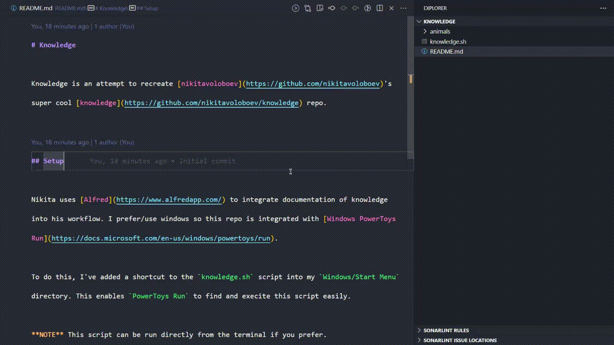

# Knowledge

Knowledge is an attempt to recreate [nikitavoloboev](https://github.com/nikitavoloboev)'s super cool [knowledge](https://github.com/nikitavoloboev/knowledge) repo with my own dev process.

## Setup

Nikita uses [Alfred](https://www.alfredapp.com/) to integrate documentation of knowledge into his workflow. I prefer/use windows so this repo is integrated with [Windows PowerToys Run](https://docs.microsoft.com/en-us/windows/powertoys/run).

To do this, I've added a shortcut to the `knowledge.sh` script into my `Windows/Start Menu` directory. This enables `PowerToys Run` to find and execite this script easily.

**NOTE** This script can be run directly from the terminal if you prefer.

## TODO

- Nicer writing flow (support opening text editor etc)
